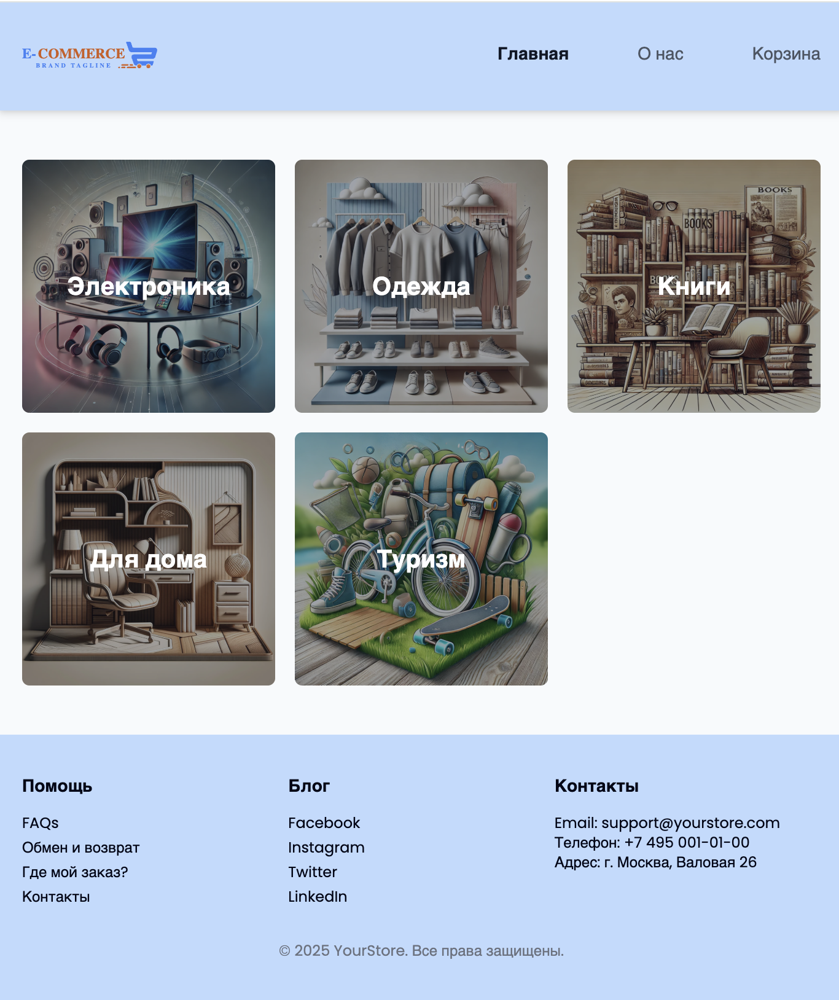

# OnlineShop - Интернет-магазин на React

Современный интернет-магазин, построенный с использованием React, React Router и Tailwind CSS. Проект демонстрирует реализацию основных функций электронной коммерции с красивым и отзывчивым интерфейсом.

## 🚀 Технологии

- **React 18.3.1** - Основная библиотека для построения пользовательского интерфейса
- **React Router DOM 7.8.0** - Маршрутизация и навигация
- **Tailwind CSS 3.4.17** - CSS фреймворк для стилизации
- **Vite 5.4.9** - Быстрый инструмент сборки
- **ESLint** - Линтер для поддержания качества кода

## 📁 Структура проекта

```
src/
├── components/          # Переиспользуемые компоненты
│   ├── Header.jsx      # Шапка сайта с навигацией
│   ├── Footer.jsx      # Подвал сайта
│   └── Layout.jsx      # Общий макет приложения
├── pages/              # Страницы приложения
│   ├── Home.jsx        # Главная страница с категориями
│   ├── Category.jsx    # Страница категории товаров
│   ├── ProductDetails.jsx # Детальная страница товара
│   ├── Cart.jsx        # Корзина и оформление заказа
│   ├── About.jsx       # Страница "О нас"
│   ├── Thanks.jsx      # Страница благодарности
│   └── NotFound.jsx    # Страница 404
├── UI/                 # UI компоненты
│   └── NavLinkMenu.jsx # Компонент навигационной ссылки
├── data/               # Данные приложения
│   └── data.js         # Категории и товары
├── App.jsx             # Главный компонент с роутингом
└── main.jsx            # Точка входа
```

## 🛍️ Функциональность

### Основные возможности:
- **Главная страница** - отображение категорий товаров с красивыми карточками
- **Каталог товаров** - просмотр товаров по категориям с фильтрацией по цене
- **Детальная страница товара** - подробная информация о товаре
- **Корзина** - оформление заказа с формой для ввода данных
- **Навигация** - удобное перемещение между страницами
- **Адаптивный дизайн** - корректное отображение на всех устройствах

### Категории товаров:
- 🖥️ **Электроника** - ноутбуки, смартфоны, наушники, мониторы
- 👕 **Одежда** - футболки, джинсы, куртки, кроссовки
- 📚 **Книги** - романы, учебники, журналы, комиксы
- 🏠 **Для дома** - стулья, столы, книжные полки, лампы
- 🏕️ **Туризм** - велосипеды, самокаты, ролики, скейтборды

## 🎨 Дизайн

Проект использует современный дизайн с:
- Чистым и минималистичным интерфейсом
- Красивыми hover-эффектами
- Градиентными наложениями на изображения
- Адаптивной сеткой для разных размеров экрана
- Семантической цветовой схемой

## 🚀 Запуск проекта

### Установка зависимостей:
```bash
npm install
```

### Запуск в режиме разработки:
```bash
npm run dev

npm run start:api
```

### Сборка для продакшена:
```bash
npm run build
```

### Предварительный просмотр сборки:
```bash
npm run preview
```

### Проверка кода линтером:
```bash
npm run lint
```

## 📱 Маршруты приложения

- `/` - Главная страница с категориями
- `/about` - Страница "О нас"
- `/cart` - Корзина и оформление заказа
- `/category/:categoryId` - Страница категории товаров
- `/product/:productId` - Детальная страница товара
- `/thanks` - Страница благодарности (с автоматическим редиректом)
- `/*` - Страница 404 для несуществующих маршрутов

## 🔧 Особенности реализации

- **React Router v7** - использование современного API для маршрутизации
- **URL параметры** - динамические маршруты для категорий и товаров
- **Search параметры** - фильтрация товаров по цене через URL
- **Программная навигация** - автоматический редирект на странице благодарности
- **Компонентная архитектура** - переиспользуемые компоненты
- **Tailwind CSS** - утилитарный подход к стилизации

## 📸 Скриншоты



Проект включает в себя красивый интерфейс с:
- Карточками категорий с наложениями
- Сеткой товаров с фильтрацией
- Формой оформления заказа
- Адаптивной навигацией

---


**Лицензия:** MIT
